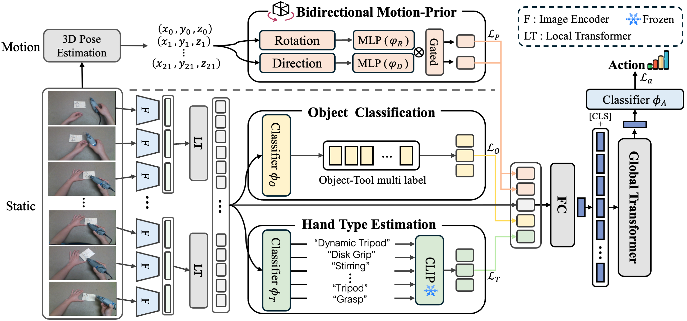
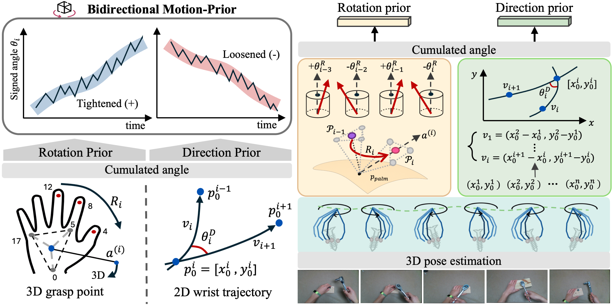
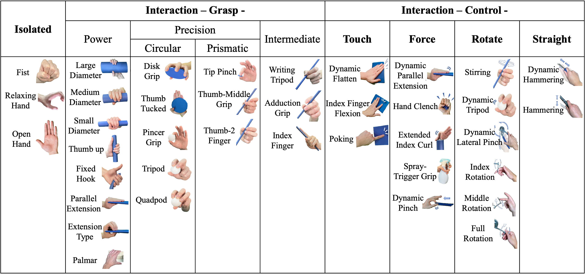

# Egocentric Hand Activity Video Dataset and Bidirectional Motion-Priors

Official implementation of the paper:

**Egocentric Hand Activity Video Dataset and Bidirectional Motion-Priors for Hand Action Recognition**

📄 [Paper (IEEE Access 2026)](https://doi.org/10.1109/ACCESS.2026.3652803)

---

## 🔍 Overview

Recognizing fine-grained hand actions from egocentric RGB videos is challenging, especially for **bidirectional action pairs** (e.g., *screw vs. unscrew*, *assemble vs. unassemble*), where visual appearance is similar and motion direction is the key cue.

This repository provides:

- **Ego-Bi dataset**: large-scale egocentric RGB dataset for tool-use scenarios  
- **BMP (Bidirectional Motion-Prior)**: motion-aware module leveraging hand dynamics  
- A unified framework combining:
  - RGB features
  - object/tool classification
  - hand type estimation
  - motion priors
<p align="center">
  
</p>

---

## ✨ Highlights

- **1,223** video sequences  
- **622,737** frames  
- **19** action classes  
- **38** hand type categories  
- **34** objects / **29** tools  
- **+8.96% improvement** on bidirectional action recognition  

---

## 🧠 Method

Our framework consists of four components:

1. **Object Multi-label Classification**  
   - predicts object/tool presence  

2. **Hand Type Estimation**  
   - predicts fine-grained functional hand types  

3. **Bidirectional Motion-Prior (BMP)**  
   - extracts motion cues from predicted 3D hand poses  
   - includes:
     - **Rotation prior** (3D grasp-point motion)  
     - **Direction prior** (2D wrist trajectory)  

4. **Global Action Transformer**  
   - fuses all features for final action prediction  

<p align="center">
  
</p>

---

## 📦 Ego-Bi Dataset

### Dataset Download

You can download the Ego-Bi dataset from the link below:

- [Ego-Bi Dataset](https://kuaicv.synology.me/weights/IEEE_Access_26/Egochand/dataset_MHAV.zip)

### Statistics

- **1,223** sequences  
- **622,737** frames  
- **19** action classes  
- **38** hand type classes  

### Action Categories

The dataset includes diverse tool-use interactions:

- manipulation (e.g., assemble, unassemble)  
- fastening (e.g., screw, unscrew)  
- surface processing (e.g., sanding, polishing)  
- cutting & shaping (e.g., cutting, carving, sawing)  
- tool operations (e.g., drilling, hammering)  

Several classes form **bidirectional pairs**, where motion direction is the key distinguishing factor.

### Annotations

Each sequence includes:

- action labels  
- object/tool labels  
- frame-wise hand type labels  
<p align="center">
  
</p>
---

## ⚙️ Requirements

### Environment

```bash
Ubuntu 20.04
Python 3.9
PyTorch 1.10.0
torchvision 0.11.0
CUDA 11.x
```

### 🎯 Training

To train the model on Ego-Bi dataset:

```bash
python train_bidirectional_.py \
  --dataset_root /path/to/Ego-Bi \
  --batch_size 2 \
  --epochs 45 \
  --lr 3e-5 \
  --max_len 128 \
  --local_len 16 \
  --experiment_tag egobi_bmp
```


### 📊 Evaluation

### Pretrained Model

You can download the pretrained BMP model from the link below:

- [Pretrained Model](https://kuaicv.synology.me/weights/IEEE_Access_26/Egochand/ckpt.zip)
```bash
python eval_bidirectional_.py \
  --dataset_root /path/to/Ego-Bi \
  --resume_path /path/to/checkpoint.pth \
  --batch_size 2
```
